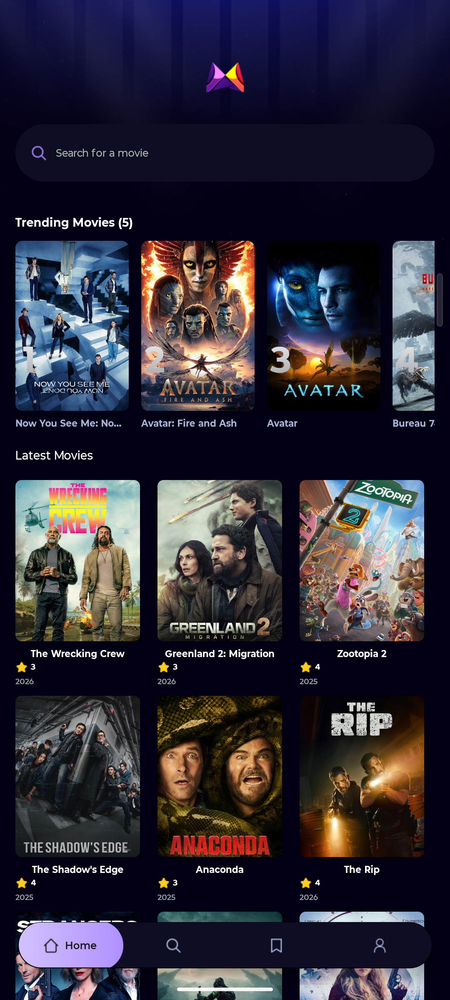
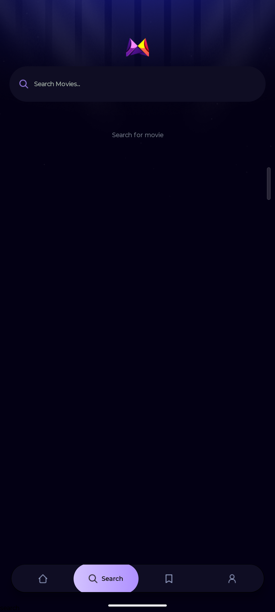
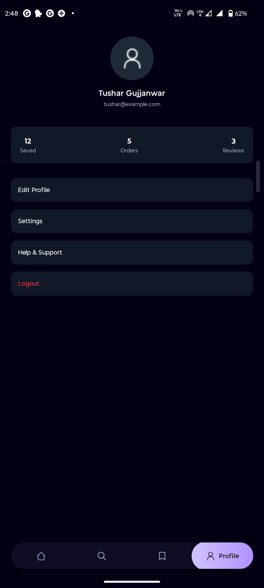
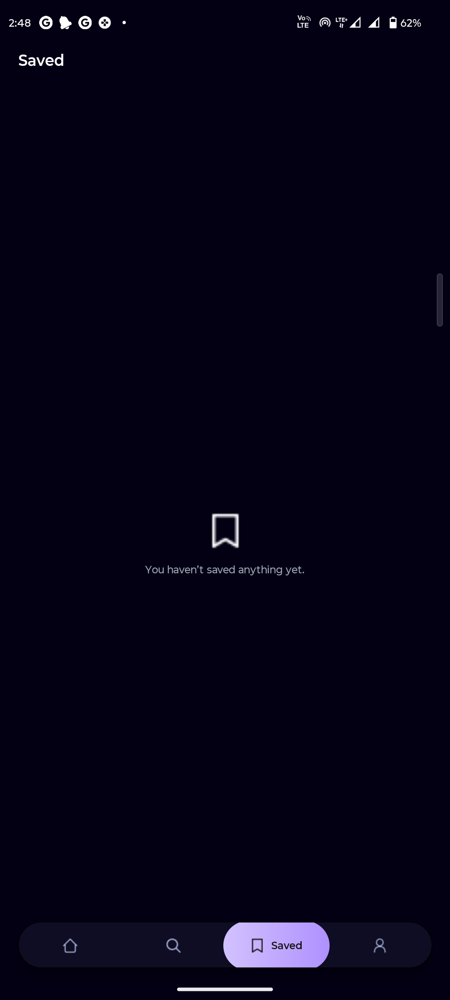

# Welcome to your Expo app 👋

This is an [Expo](https://expo.dev) project created with [`create-expo-app`](https://www.npmjs.com/package/create-expo-app).

## Get started

1. Install dependencies

   ```bash
   npm install
   ```

2. Start the app

   ```bash
   npx expo start
   ```

In the output, you'll find options to open the app in a

- [development build](https://docs.expo.dev/develop/development-builds/introduction/)
- [Android emulator](https://docs.expo.dev/workflow/android-studio-emulator/)
- [iOS simulator](https://docs.expo.dev/workflow/ios-simulator/)
- [Expo Go](https://expo.dev/go), a limited sandbox for trying out app development with Expo

You can start developing by editing the files inside the **app** directory. This project uses [file-based routing](https://docs.expo.dev/router/introduction).

## Get a fresh project

When you're ready, run:

```bash
npm run reset-project
```

```md
# 📱 Expo Go Mobile Application

This is a mobile application developed using **Expo (React Native)**.  
The app focuses on delivering a clean user interface, smooth navigation, and essential mobile app features.  
Since this application is not deployed on the Play Store or App Store, the UI and functionality are showcased using screenshots.

The app runs using **Expo Go**, allowing instant testing on real devices without building APK or IPA files.

---

## ✨ Features

- 🏠 Home screen displaying main content
- 🔍 Search screen for exploring content
- ❤️ Saved screen for bookmarked items
- 👤 Profile screen for user details
- ⚡ Fast and lightweight performance
- 📱 Responsive design for multiple screen sizes
- 🧭 File-based routing using Expo Router

---

## 🖼️ Application Screenshots

### 🏠 Home Screen

Main landing screen of the application.

  

---

### 🔍 Search Screen

Search and explore content efficiently.

  

---

### ❤️ Saved Screen

View and manage saved items.

  

---

### 👤 Profile Screen

User profile and account information.

  

---

## 🛠️ Tech Stack

- Expo
- React Native
- JavaScript
- Expo Router
- Expo Go
- Node.js
- npm

---

## 📂 Project Structure
```

expo-go-app/
│
├── app/ # Application screens (file-based routing)
├── assets/ # Images, icons, fonts
├── screenshots/ # Screenshots used in README
├── package.json
├── app.json
├── babel.config.js
└── README.md

````

---

## 🚀 Installation & Setup

Follow the steps below to run the application locally using Expo Go.

---

### ✅ Prerequisites

Ensure you have the following installed:

- Node.js (v16 or higher recommended)
- npm
- Expo Go app (Android / iOS)

---

### 1️⃣ Clone the Repository

```bash
git clone https://github.com/QUANTAMCODERR/your-repository-name.git
````

Move into the project directory:

```bash
cd your-repository-name
```

---

### 2️⃣ Install Dependencies

```bash
npm install
```

# Welcome to your Expo app 👋

This is an [Expo](https://expo.dev) project created with [`create-expo-app`](https://www.npmjs.com/package/create-expo-app).

## Get started

1. Install dependencies

```bash
npm install
```

2. Start the app

```bash
npx expo start
```

In the output, you'll find options to open the app in a

- [development build](https://docs.expo.dev/develop/development-builds/introduction/)
- [Android emulator](https://docs.expo.dev/workflow/android-studio-emulator/)
- [iOS simulator](https://docs.expo.dev/workflow/ios-simulator/)
- [Expo Go](https://expo.dev/go), a limited sandbox for trying out app development with Expo

You can start developing by editing the files inside the **app** directory. This project uses [file-based routing](https://docs.expo.dev/router/introduction).

## Get a fresh project

When you're ready, run:

```bash
npm run reset-project
```

# 📱 Expo Go Mobile Application

This is a mobile application developed using **Expo (React Native)**.  
The app focuses on delivering a clean user interface, smooth navigation, and essential mobile app features.  
Since this application is not deployed on the Play Store or App Store, the UI and functionality are showcased using screenshots.

The app runs using **Expo Go**, allowing instant testing on real devices without building APK or IPA files.

---

## ✨ Features

- 🏠 Home screen displaying main content
- 🔍 Search screen for exploring content
- ❤️ Saved screen for bookmarked items
- 👤 Profile screen for user details
- ⚡ Fast and lightweight performance
- 📱 Responsive design for multiple screen sizes
- 🧭 File-based routing using Expo Router

---

## 🖼️ Application Screenshots

### 🏠 Home Screen

Main landing screen of the application.


---

### 🔍 Search Screen

Search and explore content efficiently.


---

### ❤️ Saved Screen

View and manage saved items.


---

### 👤 Profile Screen

User profile and account information.


---

## 🛠️ Tech Stack

- Expo
- React Native
- JavaScript
- Expo Router
- Expo Go
- Node.js
- npm

---

## 📂 Project Structure

```
expo-go-app/
│
├── app/ # Application screens (file-based routing)
├── assets/ # Images, icons, fonts
├── screenshots/ # Screenshots used in README
├── package.json
├── app.json
├── babel.config.js
└── README.md

```

---

## 🚀 Installation & Setup

Follow the steps below to run the application locally using Expo Go.

---

### ✅ Prerequisites

Ensure you have the following installed:

- Node.js (v16 or higher recommended)
- npm
- Expo Go app (Android / iOS)

---

### 1️⃣ Clone the Repository

```bash
git clone https://github.com/QUANTAMCODERR/your-repository-name.git
```

Move into the project directory:

```bash
cd your-repository-name
```

---

### 2️⃣ Install Dependencies

```bash
npm install
```

---

### 3️⃣ Start the Development Server

```bash
npx expo start
```

A QR code will appear in the terminal or browser.

---

### 4️⃣ Run on Mobile Device

1. Open **Expo Go** on your phone
2. Scan the QR code
3. The app will load instantly

---

## 🧪 Run on Emulator (Optional)

### Android Emulator

- Install Android Studio
- Create an Android Virtual Device
- Press `a` after starting Expo

### iOS Simulator (macOS only)

- Install Xcode
- Press `i` after starting Expo

---

## 🔧 Available Commands

```bash
npm install            # Install dependencies
npx expo start         # Start Expo development server
npm run reset-project  # Reset to a clean Expo project
```

---

## 📌 Notes

- This app runs using **Expo Go**
- Not deployed to Play Store or App Store
- Screenshots are used to demonstrate UI
- Suitable for portfolio and learning purposes

---

## 👨‍💻 Developer

**Tushar Gujjanwar**
MCA Graduate | Mobile App Developer

- GitHub: [https://github.com/QUANTAMCODERR](https://github.com/QUANTAMCODERR)

---

## 📄 License

This project is open-source and available for educational and personal use.
